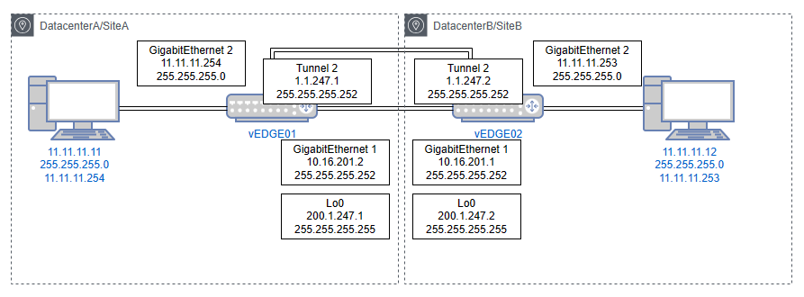

Extending Layer2 across Datacenters using Locator Identity Separation Protocol (LISP)'s!
========================================================================================

The Locator Identity Separation Protocol (LISP) is a new routing architecture that creates a new paradigm by splitting the device identity, known as an Endpoint Identifier (EID), and its location, known as its Routing Locator (RLOC), into two different numbering spaces. This capability brings renewed scale and flexibility to the network in a single protocol, enabling the areas of mobility, scalability and security. 

In this architecture, there is clear separation between "who" the endpoint is, and "where" the endpoint currently is located. By separating EIDs and RLOCs, LISP inherently enables numerous benefits within a single protocol, including:

Low OpEx multihoming with ingress traffic engineering
Address familiy independence for efficient IPv6 Transition support
High-scale Virtualization/Multi-tenancy support
Data Center/Cloud Mobility support, including session persistence across mobility events
and seamless mobile node support.

Components Involved 
===================

EID (Endpoint Identifier) - IP address of a host
RLOC (Routing Locator) - IP address of the LISP router facing ISP

ITR (Ingress Tunnel Router) -  Sends map requests and processes received map replies in order to resolve EID-to-RLOC mappings. On the data plane side, an ITR receives packets from site-facing interfaces and either LISP-encapsulates packets to remote LISP sites, or natively forwards packets to non-LISP sites.

ETR (Egress Tunnel Router) - Registers its EID prefixes and RLOCs with the Map-Server, and responds to map requests received from the Map-Server. On the data plane side, an ETR receives packets from core-facing interfaces, de-encapsulates them, and delivers them to local EIDs at the site. 

xTR - Performs both ITR/ETR functions. 

PxTR - (Proxy xTR) Accepts encapsulated traffic from LISP sites and forwards natively to non-LISP sites. Draw non-LISP traffic to itself by announcing aggregates of EID prefixes to non-LISP core. 

MS (Map Server) - An MS receives Map-Registration messages from LISP sites. It also receives Map-Requests (via the Mapping System) seeking mapping resolutions for EID prefixes and forwards them to the registered ETR that is authoritative for the EID prefix being queried.

MR (Map Resolver) - An MR receives map requests from ITRs and forwards them to the Mapping System (resulting in an MS receiving the Map-Request). An MR also sends negative map replies to ITRs in response to queries for non-LISP addresses.

EID-to-RLOC Mapping
===================
The key to using these RLOCs and EIDs is the mapping between them. A device (S1) communicating with another device (D1) will create a packet with the EID of S1 as the source IP address and the EID of D1 as the destination IP address.

.. image:: EID_to_RLOC_Mapping.png
  :width: 600
  :alt: Alternative text

At the edge of the network, when this packet needs to be routed to the Internet, an ingress tunnel router maps the destination EID to a destination RLOC and then encapsulates the original packet with an additional header that has the source IP address of the ITR RLOC and the destination IP address of the RLOC of an egress tunnel router that connects to D1. LISP specifies the way that the mappings between EIDs and RLOCs are defined, exchanged, and used.

 

"LISP" refers to the protocol used for exchanging EID-to-RLOC mapping information, the overall architecture includes two additional components: a mapping database, which consists of devices and procedures for distributing mapping information, and additional devices for implementing interworking between LISP-capable and non-LISP-capable parts of the Internet.

• Map-Request: This message is sent by an ITR to the mapping database  when it needs to send a packet to a destination EID for which is has no cached RLOC.

 

• Map-Reply: This message is returned to an ITR by an ETR or map server  in response to a Map-Request message. A Map-Reply message contains the EID prefix that matches the requested destination EID along with a set of RLOCs that can be used as the destination IP addresses for encapsulating user data. Additional information regarding priority and traffic-distribution across multiple RLOCs is also returned.

 

• Map-Register: This message is sent by an ETR to a map server to define an EID prefix that it owns as well as the RLOCs that should be used for exchanging Map-Request and Map-Reply messages. The registration request includes the EID prefix, prefix length, RLOCs associated with the prefix, and priorities and traffic-sharing weights of each RLOC. Map-Register messages are sent periodically to maintain the registration state between an ETR and its map servers.
