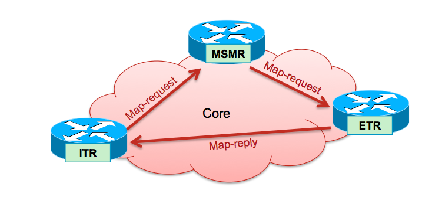
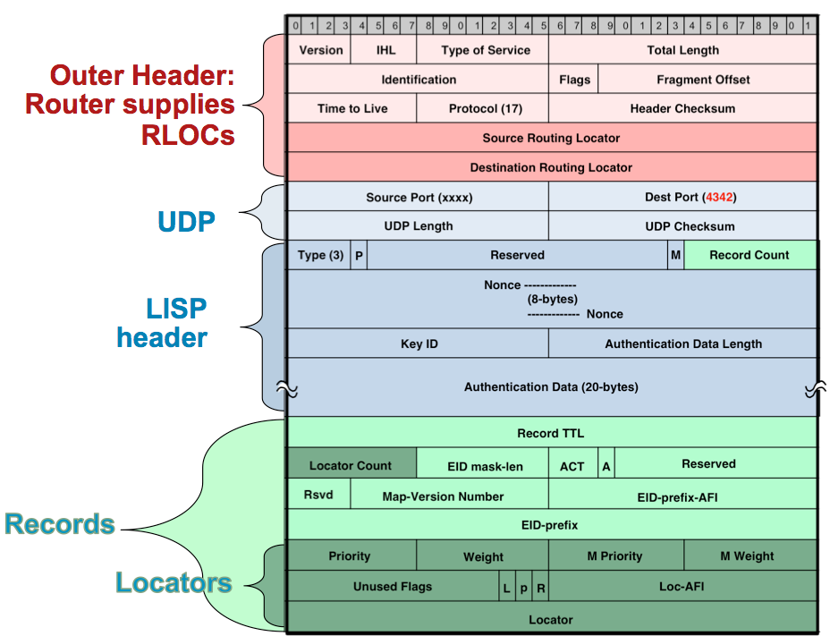

Extending Layer2 across Datacenters using Locator Identity Separation Protocol (LISP)'s!
========================================================================================

The Locator Identity Separation Protocol (LISP) is a new routing architecture that creates a new paradigm by splitting the device identity, known as an Endpoint Identifier (EID), and its location, known as its Routing Locator (RLOC), into two different numbering spaces. This capability brings renewed scale and flexibility to the network in a single protocol, enabling the areas of mobility, scalability and security. 

.. image:: network_diagram.png
  :width: 800
  :alt: Alternative text

In this architecture, there is clear separation between "who" the endpoint is, and "where" the endpoint currently is located. By separating EIDs and RLOCs, LISP inherently enables numerous benefits within a single protocol, including:

Low OpEx multihoming with ingress traffic engineering
Address familiy independence for efficient IPv6 Transition support
High-scale Virtualization/Multi-tenancy support
Data Center/Cloud Mobility support, including session persistence across mobility events
and seamless mobile node support.

Components Involved 
===================

EID (Endpoint Identifier) - IP address of a host
RLOC (Routing Locator) - IP address of the LISP router facing ISP

ITR (Ingress Tunnel Router) -  Sends map requests and processes received map replies in order to resolve EID-to-RLOC mappings. On the data plane side, an ITR receives packets from site-facing interfaces and either LISP-encapsulates packets to remote LISP sites, or natively forwards packets to non-LISP sites.

ETR (Egress Tunnel Router) - Registers its EID prefixes and RLOCs with the Map-Server, and responds to map requests received from the Map-Server. On the data plane side, an ETR receives packets from core-facing interfaces, de-encapsulates them, and delivers them to local EIDs at the site. 

xTR - Performs both ITR/ETR functions. 

PxTR - (Proxy xTR) Accepts encapsulated traffic from LISP sites and forwards natively to non-LISP sites. Draw non-LISP traffic to itself by announcing aggregates of EID prefixes to non-LISP core. 

MS (Map Server) - An MS receives Map-Registration messages from LISP sites. It also receives Map-Requests (via the Mapping System) seeking mapping resolutions for EID prefixes and forwards them to the registered ETR that is authoritative for the EID prefix being queried.

MR (Map Resolver) - An MR receives map requests from ITRs and forwards them to the Mapping System (resulting in an MS receiving the Map-Request). An MR also sends negative map replies to ITRs in response to queries for non-LISP addresses.

EID-to-RLOC Mapping
===================
The key to using these RLOCs and EIDs is the mapping between them. A device (S1) communicating with another device (D1) will create a packet with the EID of S1 as the source IP address and the EID of D1 as the destination IP address.

At the edge of the network, when this packet needs to be routed to the Internet, an ingress tunnel router maps the destination EID to a destination RLOC and then encapsulates the original packet with an additional header that has the source IP address of the ITR RLOC and the destination IP address of the RLOC of an egress tunnel router that connects to D1. LISP specifies the way that the mappings between EIDs and RLOCs are defined, exchanged, and used.

 

"LISP" refers to the protocol used for exchanging EID-to-RLOC mapping information, the overall architecture includes two additional components: a mapping database, which consists of devices and procedures for distributing mapping information, and additional devices for implementing interworking between LISP-capable and non-LISP-capable parts of the Internet.

• Map-Request: This message is sent by an ITR to the mapping database  when it needs to send a packet to a destination EID for which is has no cached RLOC.

 

• Map-Reply: This message is returned to an ITR by an ETR or map server  in response to a Map-Request message. A Map-Reply message contains the EID prefix that matches the requested destination EID along with a set of RLOCs that can be used as the destination IP addresses for encapsulating user data. Additional information regarding priority and traffic-distribution across multiple RLOCs is also returned.

LISP xTR Encap Rules:

 

1) Perform destination address lookup in the normal routing table, if the route matched is one of the following proceed with LISP encap process, otherwise forward natively:

default route (0.0.0.0/0 or ::/0)
no route
a route with a Null0 next-hop
 

2) Check if the source address of the packet is within a local EID prefix.

- If yes, the packet is eligible for LISP encapsulation.
- If no, the packet is not eligible for LISP encapsulation, and will get forwarded natively.
 

3) Perform lookup in map-cache, if entry found perform forwarding action (encap, drop, send-map-request or fwd-native), if no entry found forward natively. (As LISP control component installs default map-cache entry with action send-map-request, we will never get a miss).

 

4)If the action is to forward, then the packet is encapsulated and a destination address lookup is performed on the destination/remoteRLOC, and once the output interface is known, the source RLOC is filled in.

LISP Data Packet Header Format
==============================
 

Encapsulated user data packets are transported using UDP port 4341, and LISP control packets are transported using UDP port 4342.
 

• Map-Register: This message is sent by an ETR to a map server to define an EID prefix that it owns as well as the RLOCs that should be used for exchanging Map-Request and Map-Reply messages. The registration request includes the EID prefix, prefix length, RLOCs associated with the prefix, and priorities and traffic-sharing weights of each RLOC. Map-Register messages are sent periodically to maintain the registration state between an ETR and its map servers.

LISP xTR Encap Rules:

 

1) Perform destination address lookup in the normal routing table, if the route matched is one of the following proceed with LISP encap process, otherwise forward natively:

default route (0.0.0.0/0 or ::/0)
no route
a route with a Null0 next-hop
 

2) Check if the source address of the packet is within a local EID prefix.

- If yes, the packet is eligible for LISP encapsulation.
- If no, the packet is not eligible for LISP encapsulation, and will get forwarded natively.
 

3) Perform lookup in map-cache, if entry found perform forwarding action (encap, drop, send-map-request or fwd-native), if no entry found forward natively. (As LISP control component installs default map-cache entry with action send-map-request, we will never get a miss).

 

4)If the action is to forward, then the packet is encapsulated and a destination address lookup is performed on the destination/remoteRLOC, and once the output interface is known, the source RLOC is filled in.

LISP Data Packet Header Format
==============================

Encapsulated user data packets are transported using UDP port 4341, and LISP control packets are transported using UDP port 4342.

LISP Map-Register Header Format
===============================

Network Configuration
=====================
The network is configured as follows:

* The PCs are configured with IP addresses in the 11.11.11.0/24 subnet.
* The vEDGE01 router is configured with the following interfaces:
   * GiagbitEthernet1(10.16.201.2/30): This interface connects to the vEDGE02 - GigabitEthernet1 - 10.16.201.1/30.
   * GiagbitEthernet2(11.11.11.254/30) This interface connects to the PC1 - eth0 - 11.11.11.11/24.
   * Loopback0(200.1.247.1/32): This interface is used to establish dynamic Routing and LISP.
   * Tunnel2(1.1.247.1/32): This interface is used to establis IPSec tunnel using VTI.

* The vEDGE02 router is configured with the following interfaces:
   * GiagbitEthernet1(10.16.201.1/30): This interface connects to the vEDGE01 - GigabitEthernet1 - 10.16.201.2/30.
   * GiagbitEthernet2(11.11.11.253/30) This interface connects to the PC1 - eth0 - 11.11.11.12/24.
   * Loopback0(200.1.247.2/32): This interface is used to establish dynamic Routing and LISP.
   * Tunnel2(1.1.247.2/32): This interface is used to establis IPSec tunnel using VTI.

Lab Documentation: Extending Layer2 across Datacenters using Locator Identity Separation Protocol (LISP)'s!
===========================================================================================================
This document describes a network lab setup with two PCs (PC1, and PC2), a vEDGE router cisco 8000v (IoS XE), IPSec Site 2 Site Tunnel using SVTI, LISP and OSPF 
The lab demonstrates routing, connectivity, and L2 Extension across DC's using LISP and OSPF functionalities.

Hardware and Software:

* VMware Workstation
* EVE-NG Community Edition
* Host-only network adapters - with EVE-NG networking
* NAT adpater - EVE-NG to be access through browser
* cisco 8000v - IOS XE images
* Linux Tiny core for PC's

Lab Setup:

1. Download the VMware workstation or fusion for flavour of the operating system or if you have VMWare ESXi server then follow the below steps to provision the VM.
   * System Requirement
   * Minimum RAM: 12G
   * Processor: 2
   * HDD: 30G

2. Install the VMWare software in accordance to your operating system by following the installation guide.

   * https://docs.vmware.com/en/VMware-Workstation-Pro/17/com.vmware.ws.using.doc/GUID-7179281C-903A-46A9-89EE-C10B126D4960.html

                                        OR

   * https://www.vmware.com/pdf/desktop/fusion-getting-started-50.pdf

3. Download the prebuild EVE-NG lab OVF file from the Google Drive.

   * https://drive.google.com/file/d/1CqPXxXEIfGA8OGvMnv51i5xOQtZW5D7w/view?usp=drive_link

4. Extract or unzip the file using zip extractor or windows default zip

5. Import the OVF as below

* Starting the VMWare workstation application will open a dash board as below,

.. image:: screen1.png
  :width: 600
  :alt: Alternative text

* Click on the file menu on the Top bar, to list the available menus,

.. image:: screen2.png
  :width: 600
  :alt: Alternative text

* Click on the open menu on the DropDwon List, which will allow you choose the file to import, navigate to the location where you have downloaded and extracted the OVF files.

.. image:: screen3.png
  :width: 600
  :alt: Alternative text

6. Start the Virtual Machine by click on the start button, upon successful boot the below window appears with an ip address.

7. Open your faviroute and type the IP address show on the above screen to access the Admin GUI.

   * username: admin
   * password: eve

.. image:: eve-ng-admin-gui.png
  :width: 600
  :alt: Alternative text

8. On the EVE-NG, Admin Dashboard look for LISP.unl and click on open lab.

6. The configuration file for vEDGE01 and vEDGE02 are as below

   * Download the scripts from : https://github.com/arunkumaruniqpro/LISP

1. On pc1
---------
* Set up IP settings as follows:
   * IP address: 11.11.11.11
   * Subnet Mask: 255.255.255.0
   * Gateway: 11.11.11.254

2. On pc2
---------
* Set up IP settings as follows:
   * IP address: 11.11.11.12
   * Subnet Mask: 255.255.255.0
   * Gateway: 11.11.11.253

3. On vEDG01 - Crypto Configuration and Verification
-------------------------------------------------------
.. code-block:: console

          !
          crypto ikev2 proposal ikev2_proposal
          encryption aes-cbc-128 integrity sha1 group 14
          !
          crypto ikev2 policy ikev2_policy
          proposal ikev2_proposal
          !
          crypto ikev2 keyring ikev2_keyring
          peer vEDGE01
          address 10.16.201.1 pre-shared-key local cisco pre-shared-key remote cisco
          !
          crypto ikev2 profile ikve2_profile
          match identity remote address 10.16.201.1 255.255.255.252 identity local address 10.16.201.2 authentication remote pre-share authentication local pre-share keyring local ikev2_keyring
          !
          crypto ipsec transform-set ipsec_transform1 esp-aes 256 esp-sha512-hmac
          mode tunnel
          !
          crypto ipsec profile p2p_pf1
          set transform-set ipsec_transform1 set ikev2-profile ikve2_profile
          !

verification
------------
.. code-block:: console

            vEDGE01#sh crypto ikev2 proposal 
             IKEv2 proposal: default 
                 Encryption : AES-CBC-256
                 Integrity  : SHA512 SHA384
                 PRF        : SHA512 SHA384
                 DH Group   : DH_GROUP_256_ECP/Group 19 DH_GROUP_2048_MODP/Group 14 DH_GROUP_521_ECP/Group 21 DH_GROUP_1536_MODP/Group 5
             IKEv2 proposal: ikev2_proposal 
                 Encryption : AES-CBC-128
                 Integrity  : SHA96
                 PRF        : SHA1
                 DH Group   : DH_GROUP_2048_MODP/Group 14
            
            vEDGE01#sh crypto ikev2 policy 
             IKEv2 policy : default
                  Match fvrf : any
                  Match address local : any 
                  Proposal    : default 
             IKEv2 policy : ikev2_policy
                  Match fvrf  : global
                  Match address local : any 
                  Proposal    : ikev2_proposal 
            
            vEDGE01#sh crypto ikev2 profile 
            IKEv2 profile: ikev2_profile
             Shutdown : No
             Ref Count: 5
             Match criteria: 
              Fvrf: global
              Local address/interface: none
              Identities: 
               address 10.16.201.1 255.255.255.252
              Certificate maps: none
             Local identity: address 10.16.201.2
             Remote identity: none
             Local authentication method: pre-share
             Remote authentication method(s): pre-share
             EAP options: none
             Keyring: ikev2_keyring
             Trustpoint(s): none
             Lifetime: 86400 seconds
             DPD: disabled
             NAT-keepalive: disabled
             Ivrf: none
             Virtual-template: none
             mode auto: none
             AAA AnyConnect EAP authentication mlist: none
             AAA EAP authentication mlist: none
             AAA authentication mlist: none
             AAA Accounting: none
             AAA group authorization: none
             AAA user authorization: none
            
            vEDGE01#sh crypto ipsec transform-set 
            Transform set default: { esp-aes esp-sha-hmac  } 
               will negotiate = { Transport,  }, 
               
            Transform set ipsec_transform1: { esp-256-aes esp-sha512-hmac  } 
               will negotiate = { Tunnel,  }, 
            
            vEDGE01#sh crypto ipsec profile 
            IPSEC profile default
            Security association lifetime: 4608000 kilobytes/3600 seconds
            Dualstack (Y/N): N
            Responder-Only (Y/N): N
            PFS (Y/N): N
            Mixed-mode : Disabled
            Transform sets={ 
            default:  { esp-aes esp-sha-hmac  } , 
            }
            IPSEC profile p2p_pf1
            IKEv2 Profile: ikev2_profile
            Security association lifetime: 4608000 kilobytes/3600 seconds
            Dualstack (Y/N): N
            Responder-Only (Y/N): N
            PFS (Y/N): N
            Mixed-mode : Disabled
            Transform sets={ 
            ipsec_transform1:  { esp-256-aes esp-sha512-hmac  } , 
            }

4. On vEDG01 - Interface Configuration and Verification
-------------------------------------------------------

.. code-block:: console

          interface Loopback0
           ip address 200.1.247.1 255.255.255.255
          
          interface Tunnel2
           ip address 1.1.247.1 255.255.255.252
           ip mtu 1400
           ip tcp adjust-mss 1360
           tunnel source GigabitEthernet1
           tunnel mode ipsec ipv4
           tunnel destination 10.16.201.1
           tunnel protection ipsec profile p2p_pf1
          
          interface LISP0
          
          interface GigabitEthernet1
           ip address 10.16.201.2 255.255.255.252
           negotiation auto
           no mop enabled
           no mop sysid
          
          interface GigabitEthernet2
           ip address 11.11.11.254 255.255.255.0
           negotiation auto
           lisp mobility subnet1 nbr-proxy-reply requests 3
           no mop enabled
           no mop sysid

verification
------------
.. code-block:: console

          vEDGE01#sh ip int bri
          Interface              IP-Address      OK? Method Status                Protocol
          GigabitEthernet1       10.16.201.2     YES NVRAM  up                    up      
          GigabitEthernet2       11.11.11.254    YES manual up                    up      
          GigabitEthernet3       unassigned      YES NVRAM  administratively down down    
          GigabitEthernet4       unassigned      YES NVRAM  administratively down down    
          LISP0                  200.1.247.1     YES unset  up                    up      
          Loopback0              200.1.247.1     YES manual up                    up      
          Tunnel2                1.1.247.1       YES manual up                    up  

5. On vEDG01 - LISP & OSPF Configuration and Verification
---------------------------------------------------------
.. code-block:: console

          router lisp
           locator-set s2s
            200.1.247.1 priority 1 weight 100
            exit-locator-set
           
           service ipv4
            itr map-resolver 200.1.247.2
            itr
            etr map-server 200.1.247.2 key cisco
            etr
            use-petr 200.1.247.2
            exit-service-ipv4
           
           instance-id 0
            dynamic-eid subnet1
             database-mapping 11.11.11.0/24 locator-set s2s
             map-notify-group 239.0.0.1
             exit-dynamic-eid
            
            service ipv4
             eid-table default
             exit-service-ipv4
            
            exit-instance-id
           
           exit-router-lisp
          
          router ospf 11
           network 1.1.247.1 0.0.0.0 area 11
           network 200.1.247.1 0.0.0.0 area 11

verification
------------

.. code-block:: console

          vEDGE01#sh ip lisp map-cache
          -----------------------------------------------
           <show ip/ipv6 lisp (instance-id <0-16777200>)
           map-cache command is depreciated.
           Please use <show lisp instance-id <0-16777200>
           ipv4/ipv6 map-cacheto get desired information.
          ------------------------------------------------
          LISP IPv4 Mapping Cache for LISP 0 EID-table default (IID 0), 3 entries
          11.11.11.0/24, uptime: 03:49:07, expires: never, via dynamic-EID, send-map-request
            Negative cache entry, action: send-map-request
          11.11.11.11/32, uptime: 02:56:07, expires: 21:03:52, via map-reply, complete
            Locator      Uptime    State  Pri/Wgt     Encap-IID
            200.1.247.1  02:56:07  up       1/100       -
          11.11.11.128/25, uptime: 02:58:00, expires: 00:00:17, via map-reply, forward-native
            Negative cache entry, action: forward-native

.. code-block:: console

            vEDGE01#sh ip lisp database 
            -------------------------------------------------------
             <show ip/ipv6 lisp (instance-id <0-16777200>) database
             (EID-Prefix list)> commands are depreciated.
            
             Please use <show lisp instance-id <0-16777200>
             ipv4/ipv6 database (EID-Prefix list)> to get desired
             information.
            --------------------------------------------------------
            LISP ETR IPv4 Mapping Database for LISP 0 EID-table default (IID 0), LSBs: 0x1
            Entries total 1, no-route 0, inactive 0, do-not-register 0
            11.11.11.12/32, dynamic-eid subnet1, inherited from default locator-set dmz
              Uptime: 02:58:11, Last-change: 02:58:11
              Domain-ID: local
              Service-Insertion: N/A
              Locator      Pri/Wgt  Source     State
              200.1.247.2    1/100  cfg-addr   site-self, reachable
            
            vEDGE01# sh ip ospf nei
            Neighbor ID     Pri   State           Dead Time   Address         Interface
            200.1.247.1       0   FULL/  -        00:00:37    1.1.247.1       Tunnel2

6. On vEDG02 - Crypto Configuration and Verification
-------------------------------------------------------
.. code-block:: console

            !
            crypto ikev2 proposal ikev2_proposal 
             encryption aes-cbc-128
             integrity sha1
             group 14
            !
            crypto ikev2 policy ikev2_policy 
             proposal ikev2_proposal
            !
            crypto ikev2 keyring ikev2_keyring
             peer vEDGE01
              address 10.16.201.2
              pre-shared-key local cisco
              pre-shared-key remote cisco
             !
            !
            !
            crypto ikev2 profile ikve2_profile
             match identity remote address 10.16.201.2 255.255.255.252 
             identity local address 10.16.201.1
             authentication remote pre-share
             authentication local pre-share
             keyring local ikev2_keyring
            !
            !
            !
            !
            ! 
            !
            !
            !
            !
            !
            !
            !
            !
            crypto ipsec transform-set ipsec_transform1 esp-aes 256 esp-sha512-hmac 
             mode tunnel
            !
            !
            crypto ipsec profile p2p_pf1
             set transform-set ipsec_transform1 
             set ikev2-profile ikve2_profile
            !

verification
------------
.. code-block:: console

        
        vEDGE02#sh crypto ikev2 proposal 
         IKEv2 proposal: default 
             Encryption : AES-CBC-256
             Integrity  : SHA512 SHA384
             PRF        : SHA512 SHA384
             DH Group   : DH_GROUP_256_ECP/Group 19 DH_GROUP_2048_MODP/Group 14 DH_GROUP_521_ECP/Group 21 DH_GROUP_1536_MODP/Group 5
         IKEv2 proposal: ikev2_proposal 
             Encryption : AES-CBC-128
             Integrity  : SHA96
             PRF        : SHA1
             DH Group   : DH_GROUP_2048_MODP/Group 14
        

.. code-block:: console

          vEDGE02#sh crypto ikev2 policy 
           IKEv2 policy : default
                Match fvrf : any
                Match address local : any 
                Proposal    : default 
           IKEv2 policy : ikev2_policy
                Match fvrf  : global
                Match address local : any 
                Proposal    : ikev2_proposal 

.. code-block:: console

          vEDGE02#sh crypto ikev2 profile 
          IKEv2 profile: ikev2_profile
           Shutdown : No
           Ref Count: 5
           Match criteria: 
            Fvrf: global
            Local address/interface: none
            Identities: 
             address 10.16.201.2 255.255.255.252
            Certificate maps: none
           Local identity: address 10.16.201.1
           Remote identity: none
           Local authentication method: pre-share
           Remote authentication method(s): pre-share
           EAP options: none
           Keyring: ikev2_keyring
           Trustpoint(s): none
           Lifetime: 86400 seconds
           DPD: disabled
           NAT-keepalive: disabled
           Ivrf: none
           Virtual-template: none
           mode auto: none
           AAA AnyConnect EAP authentication mlist: none
           AAA EAP authentication mlist: none
           AAA authentication mlist: none
           AAA Accounting: none
           AAA group authorization: none
           AAA user authorization: none

.. code-block:: console

        vEDGE01#sh crypto ipsec transform-set 
        Transform set default: { esp-aes esp-sha-hmac  } 
           will negotiate = { Transport,  },    
        Transform set ipsec_transform1: { esp-256-aes esp-sha512-hmac  } 
           will negotiate = { Tunnel,  }, 

.. code-block:: console

              
              vEDGE01#sh crypto ipsec profile 
              IPSEC profile default
              Security association lifetime: 4608000 kilobytes/3600 seconds
              Dualstack (Y/N): N
              Responder-Only (Y/N): N
              PFS (Y/N): N
              Mixed-mode : Disabled
              Transform sets={ 
              default:  { esp-aes esp-sha-hmac  } , 
              }
              IPSEC profile p2p_pf1
              IKEv2 Profile: ikev2_profile
              Security association lifetime: 4608000 kilobytes/3600 seconds
              Dualstack (Y/N): N
              Responder-Only (Y/N): N
              PFS (Y/N): N
              Mixed-mode : Disabled
              Transform sets={ 
              ipsec_transform1:  { esp-256-aes esp-sha512-hmac  } , 
              }

4. On vEDG02 - Interface Configuration and Verification
-------------------------------------------------------

.. code-block:: console

              !
              interface Loopback0
               ip address 200.1.247.2 255.255.255.255
              !
              interface Tunnel2
               ip address 1.1.247.2 255.255.255.252
               ip mtu 1400
               ip tcp adjust-mss 1360
               tunnel source GigabitEthernet1
               tunnel mode ipsec ipv4
               tunnel destination 10.16.201.1
               tunnel protection ipsec profile p2p_pf1
              !
              interface LISP0
              !
              interface GigabitEthernet1
               ip address 10.16.201.1 255.255.255.252
               negotiation auto
               no mop enabled
               no mop sysid
              !
              interface GigabitEthernet2
               ip address 11.11.11.253 255.255.255.0
               negotiation auto
               lisp mobility subnet1 nbr-proxy-reply requests 3
               no mop enabled
               no mop sysid
              !

verification
------------

.. code-block:: console

            vEDGE01#sh ip int bri
            Interface              IP-Address      OK? Method Status                Protocol
            GigabitEthernet1       10.16.201.1     YES NVRAM  up                    up      
            GigabitEthernet2       11.11.11.253    YES manual up                    up      
            GigabitEthernet3       unassigned      YES NVRAM  administratively down down    
            GigabitEthernet4       unassigned      YES NVRAM  administratively down down    
            LISP0                  200.1.247.2     YES unset  up                    up      
            Loopback0              200.1.247.2     YES manual up                    up      
            Tunnel2                1.1.247.2       YES manual up                    up  

5. On vEDG02 - LISP & OSPF Configuration and Verification
---------------------------------------------------------

.. code-block:: console

            !
            router lisp
             locator-set dmz
              200.1.247.2 priority 1 weight 100
              exit-locator-set
             !
             service ipv4
              itr map-resolver 200.1.247.2
              etr map-server 200.1.247.2 key cisco
              etr
              proxy-etr
              proxy-itr 200.1.247.2
              map-server
              map-resolver
              exit-service-ipv4
             !
             instance-id 0
              dynamic-eid subnet1
               database-mapping 11.11.11.0/24 locator-set dmz
               map-notify-group 239.0.0.1
               exit-dynamic-eid
              !
              service ipv4
               eid-table default
               exit-service-ipv4
              !
              exit-instance-id
             !
             site DATA_CENTER
              authentication-key cisco
              eid-record 11.11.11.0/24 accept-more-specifics
              exit-site
             !
             exit-router-lisp
            !
            router ospf 11
             network 1.1.247.2 0.0.0.0 area 11
             network 200.1.247.2 0.0.0.0 area 11
            !

verification
------------
.. code-block:: console

          vEDGE02#sh ip lisp map-cache 
          -----------------------------------------------------------
           <show ip/ipv6 lisp (instance-id <0-16777200>)
           map-cache command is depreciated.
          
           Please use <show lisp instance-id <0-16777200>
           ipv4/ipv6 map-cacheto get desired information.
          ------------------------------------------------------------
          LISP IPv4 Mapping Cache for LISP 0 EID-table default (IID 0), 3 entries
          0.0.0.0/0, uptime: 03:11:05, expires: never, via static-send-map-request
            Negative cache entry, action: send-map-request
          11.11.11.0/24, uptime: 03:44:18, expires: never, via dynamic-EID, send-map-request
            Negative cache entry, action: send-map-request
          11.11.11.12/32, uptime: 03:11:00, expires: 20:48:59, via map-reply, complete
            Locator      Uptime    State  Pri/Wgt     Encap-IID
            200.1.247.2  03:11:00  up       1/100 

.. code-block:: console

          vEDGE02#sh ip lisp database  
          -----------------------------------------------------------
           <show ip/ipv6 lisp (instance-id <0-16777200>) database
           (EID-Prefix list)> commands are depreciated.
           Please use <show lisp instance-id <0-16777200>
           ipv4/ipv6 database (EID-Prefix list)> to get desired
           information.
          ------------------------------------------------------------
          LISP ETR IPv4 Mapping Database for LISP 0 EID-table default (IID 0), LSBs: 0x1
          Entries total 1, no-route 0, inactive 0, do-not-register 0
          11.11.11.11/32, dynamic-eid subnet1, inherited from default locator-set s2s
            Uptime: 03:11:55, Last-change: 03:11:55
            Domain-ID: local
            Service-Insertion: N/A
            Locator      Pri/Wgt  Source     State
            200.1.247.1    1/100  cfg-addr   site-self, reachable

.. code-block:: console

            
            vEDGE02#sh ip ospf nei
            Neighbor ID     Pri   State           Dead Time   Address         Interface
            200.1.247.2       0   FULL/  -        00:00:30    1.1.247.2       Tunnel2

